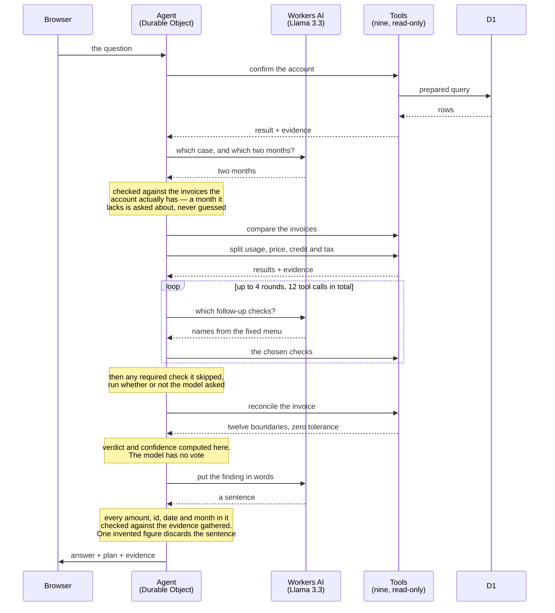

# How Billing Investigator works

A read-only agent that investigates "why is my invoice higher this month?" — and the
reason almost none of the answer comes from the language model.

Written for a reader who has not seen the code. `ARCHITECTURE.md` is the version for
someone who has.

---

## The problem

A customer's August bill comes to **$21,720**. July was **$16,900**. They want to know why,
and whether the extra **$4,820** is real.

Answering that means doing three separate jobs: *reading the records*, *doing the
arithmetic*, and *explaining what it means*. The whole design of this app comes from one
decision about which of those three an AI is allowed to touch.

## The rule that shapes everything

Language models are good at explaining and bad at being reliably exact. Ask one to add up a
column of money and it will usually be right — and occasionally, fluently, wrong. In a
billing dispute a confidently wrong number is worse than no answer at all.

So the arithmetic lives in ordinary TypeScript, tested to the cent, and the model never sees
it until it is finished.

| Lane | Means |
|---|---|
| **Computed** | Plain code. Same answer every time. |
| **Model** | Chooses and explains. Never calculates. |

## One question, start to finish

Five parts talk to each other, and time runs downward. The two lanes from the table
above are visible in the shape: the model is consulted three times, and everything
between those three calls is ordinary code.

Two things in that shape are easy to miss.

**The first database lookup happens before the model is asked anything.** It has to:
the agent needs to know which invoices the account actually has, or there is nothing to
check the model's answer against. When the opening checks want the same lookup a moment
later, the stored result is reused rather than the database asked twice.

**By the second-to-last step, the answer already exists.** The figures are computed, the
verdict is decided, and a plainly-worded version is ready to send. The model is offered
the chance to say it better, and the guard takes that offer back if the sentence strays
from the evidence. Were Workers AI unreachable, the investigation would still answer —
just less fluently.

The same seven steps, in detail:

| # | Step | Lane | What happens |
|---|---|---|---|
| 1 | Read the question | Model | Works out this is an invoice-variance case and which two months to compare. If you name the months yourself, your choice wins outright. |
| 2 | Run the fixed opening checks | Computed | Confirm the account, compare the two invoices, split the difference into usage, price, credit and tax effects. Always these three, always in this order. |
| 3 | Choose which follow-up checks to run | Model | Picks from a fixed menu — daily usage, contract pricing, when usage moved, nearby deployments, duplicate charges. It can only choose from the list, and only 12 tool calls are allowed. |
| 4 | Run any required check it skipped | Computed | If a check is mandatory, the server runs it whether or not the model asked. A required check that depends on the model remembering isn't required. |
| 5 | Reconcile the invoice | Computed | Rebuild the bill from raw usage upward and compare it to what was charged, at 12 separate boundaries. Zero tolerance — a one-cent gap fails. |
| 6 | Decide the verdict and the confidence | Computed | "Appears correct" requires a passing reconciliation and every dollar of the variance explained. The model has no vote here and cannot change the rating. |
| 7 | Write the explanation | Model | Then a guard checks every amount, ID, date, percentage and month in that sentence against the evidence actually gathered. One invented figure and the whole sentence is discarded for a plain generated one. |

The model touches steps 1, 3 and 7. Nothing in between.

---

## What each Cloudflare piece does

### Workers — the code, everywhere at once

Normally your app lives on one computer in one city and everyone's request travels there and
back. A Worker is more like a chain with a kitchen in every town.

Cloudflare runs the same code in whichever of its data centres is nearest the person asking.
No servers to provision, patch or scale. It also serves the React interface from the same
deployment, so the whole thing ships with one `npm run deploy`.

### D1 — the filing cabinet

Somewhere to keep the records and look things up.

A SQL database (SQLite) holding ten tables of synthetic billing data — usage events, daily
rollups, contract prices, rated charges, invoice lines, deployments. Every query is a
prepared statement written by us; the model never sees SQL and cannot write any.

### Durable Objects — the notebook, and only one pen

A normal Worker forgets everything the moment it finishes. That is no good for an
investigation that takes eleven steps and then answers follow-up questions.

A Durable Object is code *with memory attached*, and there is exactly one of each, doing one
thing at a time. That single-threaded guarantee is what makes "reset the demo while a turn is
still running" solvable: the check and the write cannot be interleaved by anything else. Each
browser gets its own, so two people reading the demo never share a conversation.

### Workers AI — the language expert on call

Someone who is good with words, sitting next to the accountant rather than replacing them.

Runs Llama 3.3 on Cloudflare's GPUs. No GPU to rent, no other company's API key, and the
billing data never leaves the network. Its context window is 24,000 tokens — which sounds
enormous and is not, so the tools return small summaries and the full daily series goes to
the screen instead of the prompt.

### Agents SDK — the plumbing

The wiring nobody sees. Routes browser traffic to the right Durable Object, holds the
websocket open, keeps the chat history, and syncs the plan, evidence and summary to the
screen — which is why a page refresh restores the investigation exactly as it was.

---

## What we deliberately left out

All real options that would earn their place in a bigger version. Excluded to keep the first
build to the smallest thing that could credibly work.

| Not used | Why it would matter later |
|---|---|
| **Workflows** | Lets a process pause for hours or days — waiting on a human approval, say. Overkill for an investigation that finishes in twenty seconds. |
| **AI Gateway** | Logs, caches and rate-limits every model call. Genuinely useful in production; not needed to prove the idea works. |
| **Vectorize + R2** | Would let the agent search real contract PDFs instead of a tidy database. A much harder and more interesting problem, and a different project. |
| **KV, Queues** | Caching and background jobs. The whole investigation is fast and synchronous, so neither has anything to do yet. |

> "R2" and "D1" appear as synthetic **invoice line items** in the seeded data. The R2 product
> is not used as infrastructure. D1 is required infrastructure.

---

## Other ways to build the same thing

Nothing here needs Cloudflare specifically. These are the routes a team would realistically
weigh instead.

### The classic cloud

`AWS Lambda · RDS Postgres · Bedrock or OpenAI · Redis for sessions`

- **Gain** — mature tooling, deep talent pool, a database that scales to a real billing warehouse.
- **Cost** — you rebuild the Durable Object guarantee yourself: a separate session store plus
  your own locking. Several of the bugs found in review were exactly that class of problem.

### One plain server

`Node · Postgres · sessions in memory`

- **Gain** — the simplest thing that works, and by far the easiest to reason about and debug.
- **Cost** — fine until you need a second server, then "which machine has my conversation?"
  becomes your problem. It is the same problem, just later.

### The fast-to-ship stack

`Vercel · Neon or Supabase · OpenAI or Anthropic`

- **Gain** — probably running by lunchtime, with the widest choice of frontier models.
- **Cost** — four vendors instead of one, four bills, four status pages, and customer billing
  data leaving your network to reach the model.

### No AI at all

`the same TypeScript · a charting library · no model`

- **Gain** — around 90% of this app is deterministic code already. As a dashboard it would be
  faster, cheaper, and never wrong.
- **Cost** — someone has to know which chart to look at. You lose the actual product: asking a
  question in your own words and getting a written answer back.

---

## The honest trade-off

**What Cloudflare gave us**

- **One vendor, one deploy.** Compute, database, model and stateful sessions from a single
  account, with no API key to any outside service.
- **State without a state store.** Durable Objects removed an entire component, and with it a
  category of concurrency bug.
- **Data stays put.** Running the model on Workers AI means invoice data never leaves the network.
- **Nothing to provision.** No servers, no GPUs, no connection pools.

**What it cost**

- **D1 is SQLite.** Ideal at this size; not where a real billing warehouse would live.
- **Fewer models.** Workers AI has a smaller catalogue than the big model APIs.
- **Newer edges.** We hit a real bug in the `workers-ai-provider` library that corrupts
  streamed tool arguments, and had to drop token-by-token streaming because of it. See
  `docs/BUILD_STATUS.md`.
- **Less prior art.** Fewer worked examples to copy when something behaves unexpectedly.

---

All customer, contract, pricing, usage and invoice data in this project is synthetic and
fictional. Prices and pipeline boundaries are illustrative and do not reflect Cloudflare
pricing. The application is read-only: it never changes contracts, usage, invoices, credits or
payments, and "appears correct" is an operational assessment, not a financial certification.
